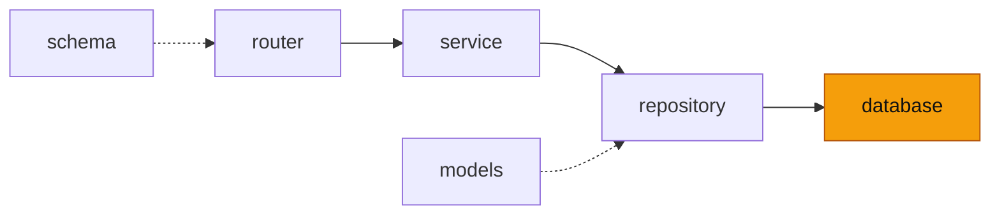

# database — 에이전트 봇의 Oracle 연결 자리(`guidans_Chat/database/oracle.py` 참고). MongoDB 는 쓰지 않는다. 아직 없음.

<!-- readme-overview -->
이 폴더의 위치 (예정):

```mermaid
flowchart LR
    router --> service --> repository --> database
    schema -.-> router
    models -.-> repository
    style database fill:#f59e0b,color:#111,stroke:#b45309
```
<!-- /readme-overview -->
