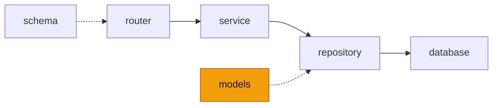

# models — 에이전트 봇이 Oracle 에 저장할 테이블 한 행의 모양(데이터클래스) 자리. 아직 없음.

<!-- readme-overview -->
이 폴더의 위치 (예정):

```mermaid
flowchart LR
    router --> service --> repository --> database
    schema -.-> router
    models -.-> repository
    style models fill:#f59e0b,color:#111,stroke:#b45309
```
<!-- /readme-overview -->
