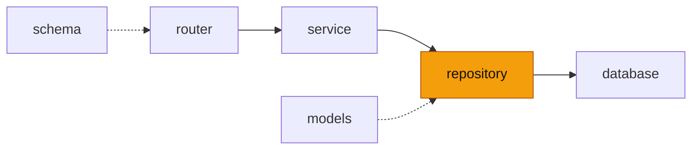

# repository — 에이전트 봇의 Oracle SQL 실행 자리(`guidans_Chat/repository/base.py` 의 OracleRepository 를 참고). 아직 없음.

<!-- readme-overview -->
이 폴더의 위치 (예정):

```mermaid
flowchart LR
    router --> service --> repository --> database
    schema -.-> router
    models -.-> repository
    style repository fill:#f59e0b,color:#111,stroke:#b45309
```
<!-- /readme-overview -->
