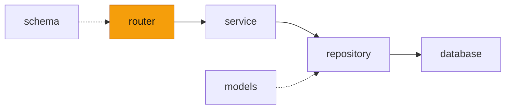

# router — 에이전트 봇 HTTP 라우터 자리. 구현 시 경로 접두사 `/agent` 를 쓴다(가이드 챗봇 `/chat` 과 겹치지 않게). 아직 없음.

<!-- readme-overview -->
이 폴더의 위치 (예정):

```mermaid
flowchart LR
    router --> service --> repository --> database
    schema -.-> router
    models -.-> repository
    style router fill:#f59e0b,color:#111,stroke:#b45309
```
<!-- /readme-overview -->
