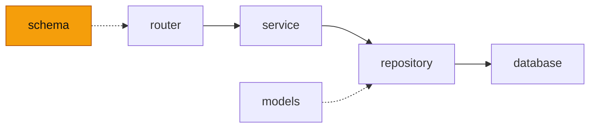

# schema — 에이전트 봇 요청·응답 스키마(pydantic) 자리. 아직 없음(계획 단계).

<!-- readme-overview -->
이 폴더의 위치 (예정):

```mermaid
flowchart LR
    router --> service --> repository --> database
    schema -.-> router
    models -.-> repository
    style schema fill:#f59e0b,color:#111,stroke:#b45309
```
<!-- /readme-overview -->
